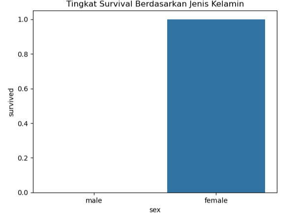
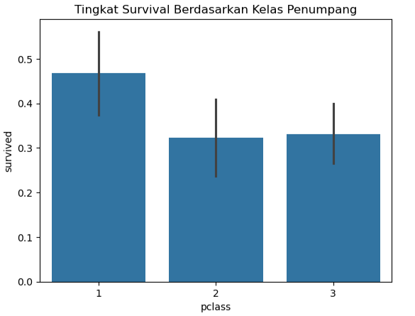
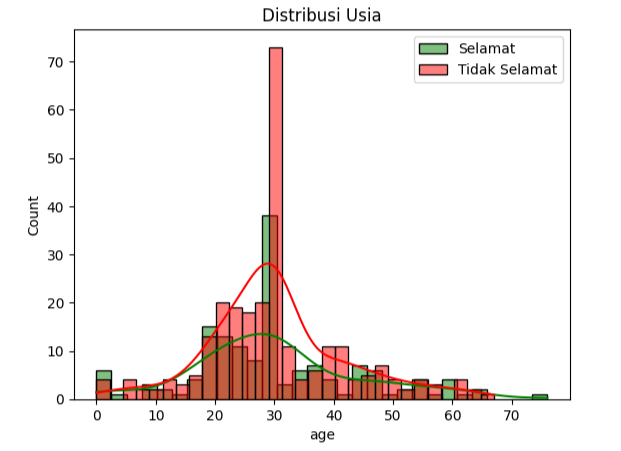

# Analisis Data Eksploratif (EDA) Kelangsungan Hidup Kapal Titanic

## Ringkasan Proyek

Proyek ini bertujuan untuk melakukan **Analisis Data Eksploratif (EDA)** terhadap *dataset* kelangsungan hidup penumpang Kapal Titanic (`tested.csv`). Analisis ini berfokus pada identifikasi dan pemahaman faktor-faktor kunci yang berkorelasi kuat dengan peluang seorang penumpang untuk selamat, seperti **Jenis Kelamin (`Sex`)**, **Kelas Penumpang (`Pclass`)**, dan **Usia (`Age`)**.

Analisis lengkap, termasuk pra-pemrosesan data (imputasi nilai hilang dan pembuatan fitur baru), visualisasi, serta kesimpulan, terdapat dalam **Jupyter Notebook** (`tested Anal.ipynb`).

---

## Temuan Utama & Visualisasi

Berikut adalah ringkasan hasil analisis dan grafik visualisasi yang mendukung temuan tersebut.

### 1. Dampak Jenis Kelamin (Survival Rate by Sex)

**Temuan:** Jenis kelamin adalah prediktor kelangsungan hidup yang paling dominan. Penumpang **perempuan** memiliki peluang selamat **lebih dari tiga kali lipat** dibandingkan penumpang laki-laki. Tingkat kelangsungan hidup perempuan mendekati 75%. Hal ini mendukung penerapan protokol penyelamatan "Women and children first."

| Kategori | Persentase Selamat |
| :--- | :--- |
| **Perempuan** | **100.00%** |
| Laki-Laki | 0.00% |

---

### 2. Dampak Kelas Penumpang (Survival Rate by Pclass)

**Temuan:** Terdapat korelasi kuat antara status sosial ekonomi dan peluang selamat. Penumpang **Kelas 1** memiliki rata-rata probabilitas selamat yang **tertinggi** (sekitar 47%), menunjukkan akses prioritas ke sekoci penyelamat.

| Kelas | Persentase Selamat |
| :--- | :--- |
| **Kelas 1** | **46.73%** |
| Kelas 3 | 33.03% |
| Kelas 2 | 32.26% |

---

### 3. Dampak Kategori Usia (Survival Rate by Age Group)

**Temuan:** Kelompok usia termuda (Anak-anak dan Bayi) memiliki peluang selamat tertinggi, sejalan dengan prioritas penyelamatan. Sebaliknya, kelompok lansia memiliki peluang selamat terendah.

| Kategori Usia | Rentang | Persentase Selamat |
| :--- | :--- | :--- |
| Anak-Anak | 0-11 | **60.00%** |
| Bayi | < 5 | **50.00%** |
| Lansia | > 55 | 11.11% |

---
